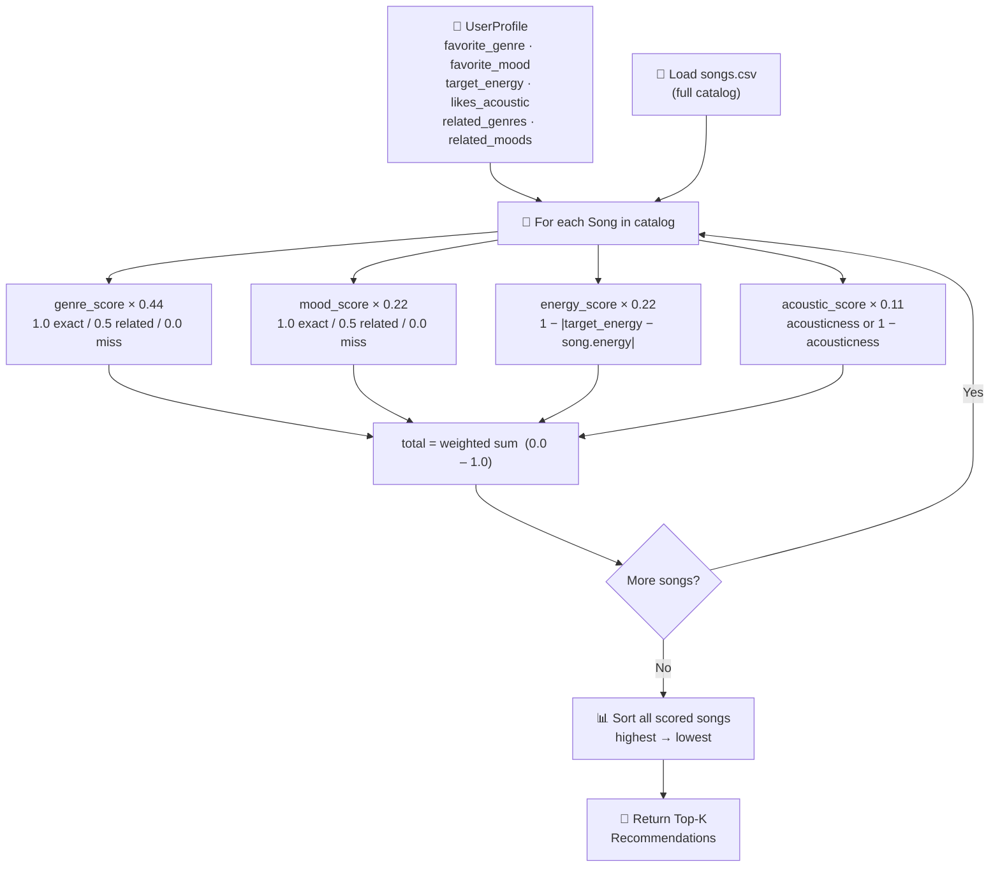

# 🎵 Music Recommender Simulation

## Project Summary

In this project you will build and explain a small music recommender system.

Your goal is to:

- Represent songs and a user "taste profile" as data
- Design a scoring rule that turns that data into recommendations
- Evaluate what your system gets right and wrong
- Reflect on how this mirrors real world AI recommenders

Replace this paragraph with your own summary of what your version does.

---

## How The System Works

Real-world recommenders like Spotify and YouTube combine two strategies: **collaborative filtering** (learning from what similar users enjoyed) and **content-based filtering** (matching songs by their audio and descriptive attributes). This version prioritizes content-based filtering — it does not need any data from other users and works purely from song attributes and a single user's stated preferences, making it transparent and easy to reason about.

**What features does each `Song` use?**
Each song is represented by seven attributes drawn from `data/songs.csv`: two categorical features — `genre` (e.g. lofi, rock, pop) and `mood` (e.g. chill, intense, happy) — and five numerical features normalized to a 0–1 scale: `energy`, `tempo_bpm`, `valence`, `danceability`, and `acousticness`. Genre and mood carry the most weight because they define the broadest boundaries of taste; the numerical features fine-tune similarity within those boundaries.

**What information does the `UserProfile` store?**
The user profile stores four core fields: `favorite_genre` (e.g. "lofi"), `favorite_mood` (e.g. "chill"), `target_energy` (a float between 0 and 1), and `likes_acoustic` (a boolean). To avoid penalizing closely related genres and moods, the profile also supports two optional lists — `related_genres` (e.g. `["ambient"]`) and `related_moods` (e.g. `["focused", "relaxed"]`) — that earn partial credit instead of scoring zero on a mismatch.

**How does the `Recommender` compute a score for each song?**
Each feature produces a 0–1 sub-score, then each is multiplied by a normalized weight so the final total always sits between 0 and 1. Genre and mood use a three-tier rule: **1.0** for an exact match, **0.5** if the song's value appears in `related_genres` or `related_moods`, and **0.0** otherwise — this prevents aurally close songs (e.g. ambient≈lofi, focused≈chill) from being unfairly discarded while keeping hard mismatches near zero. Genre carries weight **0.44** (the strongest signal); mood carries **0.22** (meaningful but secondary). Energy uses a proximity formula (`1.0 - |target_energy - song.energy|`, weight **0.22**) so songs closer to the user's preferred intensity score higher. Acousticness is `song.acousticness` if `likes_acoustic=True` or `1 - song.acousticness` if `False` (weight **0.11**) — a scaled tie-breaker. The weights were derived by assigning raw points (2.0 / 1.0 / 1.0 / 0.5) and dividing each by the 4.5 maximum.

**How do you choose which songs to recommend?**
Every song in the catalog is scored against the user profile using the weighted formula above. The songs are then sorted from highest to lowest total score and the top results are returned as recommendations. This separation — scoring first, ranking second — mirrors how production recommenders work: scoring evaluates each song independently, while ranking decides the order the user actually sees.

```
User Profile
  favorite_genre=lofi,  related_genres=["ambient"]
  favorite_mood=chill,  related_moods=["focused", "relaxed"]
  target_energy=0.40,   likes_acoustic=True
        │
        ▼
┌────────────────────────────────────────────────────────────┐
│           SCORING (per song)  output: 0.0 – 1.0            │
│                                                            │
│  genre_score  × 0.44  (1.0 exact / 0.5 related / 0.0 miss)│
│  mood_score   × 0.22  (1.0 exact / 0.5 related / 0.0 miss)│
│  energy_score × 0.22  (1 - |target - song.energy|)        │
│  acoustic_score×0.11  (acousticness or 1-acousticness)     │
│                                                            │
│  total = weighted sum  (weights sum to 1.0)                │
└────────────────────────────────────────────────────────────┘
        │
        ├─── "Storm Runner"  (rock/intense)  →  0.12 ❌ no match
        ├─── "Spacewalk"     (ambient/chill) →  0.73 ✅ related genre + exact mood
        ├─── "Focus Flow"    (lofi/focused)  →  0.86 ✅ exact genre + related mood
        └─── "Library Rain"  (lofi/chill)    →  0.96 ✅ exact genre + exact mood
        ▼
┌────────────────────────────────────────────────────────────┐
│                   RANKING (all songs)                      │
│                                                            │
│  #1  Library Rain      0.96                                │
│  #2  Focus Flow        0.86                                │
│  #3  Spacewalk         0.73                                │
│  ...                                                       │
└────────────────────────────────────────────────────────────┘
        │
        ▼
  Top-N Recommendations returned
```

### Data Flow Overview



---

## Getting Started

### Setup

1. Create a virtual environment (optional but recommended):

   ```bash
   python -m venv .venv
   source .venv/bin/activate      # Mac or Linux
   .venv\Scripts\activate         # Windows

2. Install dependencies

```bash
pip install -r requirements.txt
```

3. Run the app:

```bash
python -m src.main
```

### Running Tests

Run the starter tests with:

```bash
pytest
```

You can add more tests in `tests/test_recommender.py`.

---

## Experiments You Tried

Use this section to document the experiments you ran. For example:

- What happened when you changed the weight on genre from 2.0 to 0.5
- What happened when you added tempo or valence to the score
- How did your system behave for different types of users

---

## Limitations and Risks

Summarize some limitations of your recommender.

Examples:

- It only works on a tiny catalog
- It does not understand lyrics or language
- It might over favor one genre or mood

You will go deeper on this in your model card.

---

## Reflection

Read and complete `model_card.md`:

[**Model Card**](model_card.md)

Write 1 to 2 paragraphs here about what you learned:

- about how recommenders turn data into predictions
- about where bias or unfairness could show up in systems like this


---

## 7. `model_card_template.md`

Combines reflection and model card framing from the Module 3 guidance. :contentReference[oaicite:2]{index=2}  

```markdown
# 🎧 Model Card - Music Recommender Simulation

## 1. Model Name

Give your recommender a name, for example:

> VibeFinder 1.0

---

## 2. Intended Use

- What is this system trying to do
- Who is it for

Example:

> This model suggests 3 to 5 songs from a small catalog based on a user's preferred genre, mood, and energy level. It is for classroom exploration only, not for real users.

---

## 3. How It Works (Short Explanation)

Describe your scoring logic in plain language.

- What features of each song does it consider
- What information about the user does it use
- How does it turn those into a number

Try to avoid code in this section, treat it like an explanation to a non programmer.

---

## 4. Data

Describe your dataset.

- How many songs are in `data/songs.csv`
- Did you add or remove any songs
- What kinds of genres or moods are represented
- Whose taste does this data mostly reflect

---

## 5. Strengths

Where does your recommender work well

You can think about:
- Situations where the top results "felt right"
- Particular user profiles it served well
- Simplicity or transparency benefits

---

## 6. Limitations and Bias

Where does your recommender struggle

Some prompts:
- Does it ignore some genres or moods
- Does it treat all users as if they have the same taste shape
- Is it biased toward high energy or one genre by default
- How could this be unfair if used in a real product

---

## 7. Evaluation

How did you check your system

Examples:
- You tried multiple user profiles and wrote down whether the results matched your expectations
- You compared your simulation to what a real app like Spotify or YouTube tends to recommend
- You wrote tests for your scoring logic

You do not need a numeric metric, but if you used one, explain what it measures.

---

## 8. Future Work

If you had more time, how would you improve this recommender

Examples:

- Add support for multiple users and "group vibe" recommendations
- Balance diversity of songs instead of always picking the closest match
- Use more features, like tempo ranges or lyric themes

---

## 9. Personal Reflection

A few sentences about what you learned:

- What surprised you about how your system behaved
- How did building this change how you think about real music recommenders
- Where do you think human judgment still matters, even if the model seems "smart"

