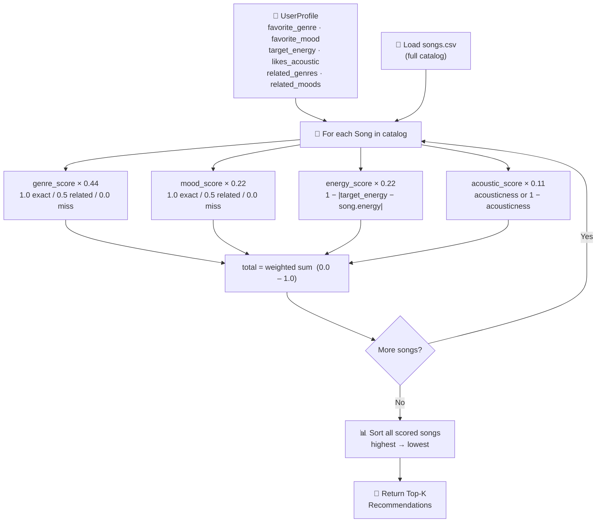
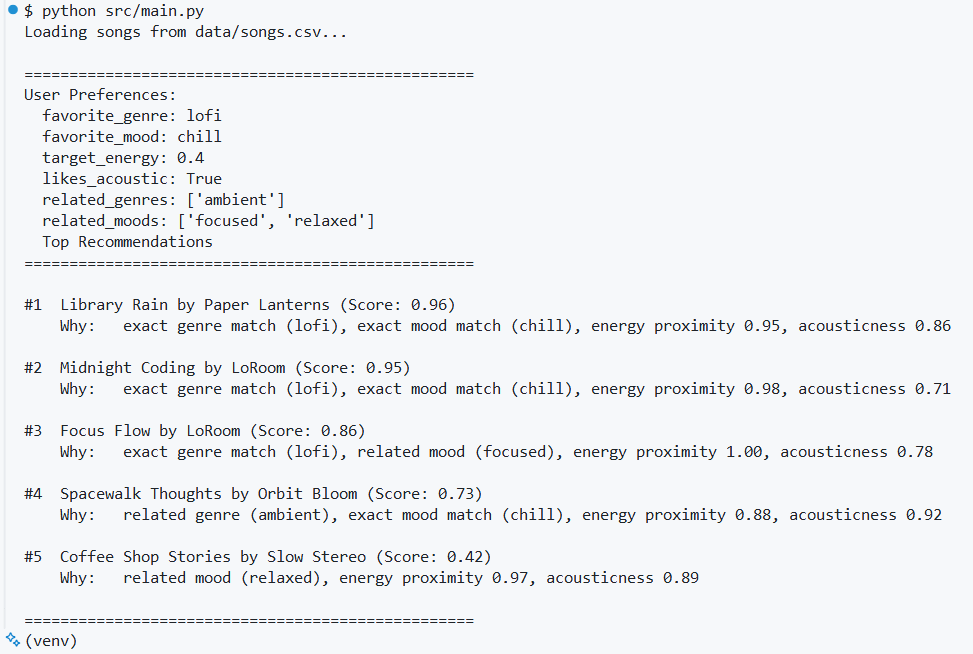

# 🎵 Music Recommender Simulation

## Project Summary

In this project you will build and explain a small music recommender system.

Your goal is to:

- Represent songs and a user "taste profile" as data
- Design a scoring rule that turns that data into recommendations
- Evaluate what your system gets right and wrong
- Reflect on how this mirrors real world AI recommenders

Replace this paragraph with your own summary of what your version does.

---

## How The System Works

Real-world recommenders like Spotify and YouTube combine two strategies: **collaborative filtering** (learning from what similar users enjoyed) and **content-based filtering** (matching songs by their audio and descriptive attributes). This version prioritizes content-based filtering — it does not need any data from other users and works purely from song attributes and a single user's stated preferences, making it transparent and easy to reason about.

**What features does each `Song` use?**
Each song is represented by seven attributes drawn from `data/songs.csv`: two categorical features — `genre` (e.g. lofi, rock, pop) and `mood` (e.g. chill, intense, happy) — and five numerical features normalized to a 0–1 scale: `energy`, `tempo_bpm`, `valence`, `danceability`, and `acousticness`. Genre and mood carry the most weight because they define the broadest boundaries of taste; the numerical features fine-tune similarity within those boundaries.

**What information does the `UserProfile` store?**
The user profile stores four core fields: `favorite_genre` (e.g. "lofi"), `favorite_mood` (e.g. "chill"), `target_energy` (a float between 0 and 1), and `likes_acoustic` (a boolean). To avoid penalizing closely related genres and moods, the profile also supports two optional lists — `related_genres` (e.g. `["ambient"]`) and `related_moods` (e.g. `["focused", "relaxed"]`) — that earn partial credit instead of scoring zero on a mismatch.

**How does the `Recommender` compute a score for each song?**
Each feature produces a 0–1 sub-score, then each is multiplied by a normalized weight so the final total always sits between 0 and 1. Genre and mood use a three-tier rule: **1.0** for an exact match, **0.5** if the song's value appears in `related_genres` or `related_moods`, and **0.0** otherwise — this prevents aurally close songs (e.g. ambient≈lofi, focused≈chill) from being unfairly discarded while keeping hard mismatches near zero. Genre carries weight **0.44** (the strongest signal); mood carries **0.22** (meaningful but secondary). Energy uses a proximity formula (`1.0 - |target_energy - song.energy|`, weight **0.22**) so songs closer to the user's preferred intensity score higher. Acousticness is `song.acousticness` if `likes_acoustic=True` or `1 - song.acousticness` if `False` (weight **0.11**) — a scaled tie-breaker. The weights were derived by assigning raw points (2.0 / 1.0 / 1.0 / 0.5) and dividing each by the 4.5 maximum.

**How do you choose which songs to recommend?**
Every song in the catalog is scored against the user profile using the weighted formula above. The songs are then sorted from highest to lowest total score and the top results are returned as recommendations. This separation — scoring first, ranking second — mirrors how production recommenders work: scoring evaluates each song independently, while ranking decides the order the user actually sees.

```
User Profile
  favorite_genre=lofi,  related_genres=["ambient"]
  favorite_mood=chill,  related_moods=["focused", "relaxed"]
  target_energy=0.40,   likes_acoustic=True
        │
        ▼
┌────────────────────────────────────────────────────────────┐
│           SCORING (per song)  output: 0.0 – 1.0            │
│                                                            │
│  genre_score  × 0.44  (1.0 exact / 0.5 related / 0.0 miss)│
│  mood_score   × 0.22  (1.0 exact / 0.5 related / 0.0 miss)│
│  energy_score × 0.22  (1 - |target - song.energy|)        │
│  acoustic_score×0.11  (acousticness or 1-acousticness)     │
│                                                            │
│  total = weighted sum  (weights sum to 1.0)                │
└────────────────────────────────────────────────────────────┘
        │
        ├─── "Storm Runner"  (rock/intense)  →  0.12 ❌ no match
        ├─── "Spacewalk"     (ambient/chill) →  0.73 ✅ related genre + exact mood
        ├─── "Focus Flow"    (lofi/focused)  →  0.86 ✅ exact genre + related mood
        └─── "Library Rain"  (lofi/chill)    →  0.96 ✅ exact genre + exact mood
        ▼
┌────────────────────────────────────────────────────────────┐
│                   RANKING (all songs)                      │
│                                                            │
│  #1  Library Rain      0.96                                │
│  #2  Focus Flow        0.86                                │
│  #3  Spacewalk         0.73                                │
│  ...                                                       │
└────────────────────────────────────────────────────────────┘
        │
        ▼
  Top-N Recommendations returned
```

### Data Flow Overview



### Preview 
Here is a preview of what the output looks like when you run the app: 



## Getting Started

### Setup

1. Create a virtual environment (optional but recommended):

   ```bash
   python -m venv .venv
   source .venv/bin/activate      # Mac or Linux
   .venv\Scripts\activate         # Windows

2. Install dependencies

```bash
pip install -r requirements.txt
```

3. Run the app:

```bash
python -m src.main
```

### Running Tests

Run the starter tests with:

```bash
pytest
```

You can add more tests in `tests/test_recommender.py`.

---

## Experiments You Tried

- **What happened when you changed the weight on genre from 0.44 to 0.22 (swapped with energy):** High-energy songs began separating in rank instead of clustering, the score cliff between #1 and #2 shrank significantly, and the "Impossible Unicorn" profile's max achievable score jumped from 0.28 to 0.47 — confirming genre dominance was the primary driver of filter-bubble behavior.

- **What happened when you added acousticness to the score:** It acted as a meaningful tie-breaker between otherwise equally-scored songs, but also introduced a silent penalty for acoustic songs when `likes_acoustic=False` — a penalty that never appeared in the explanation output, making it invisible to the user.

- **How did your system behave for different types of users:** Users with clear, consistent preferences (e.g. Study/Focus) got tight, intuitive top-5 results with scores above 0.85, while adversarial users with contradictory or catalog-absent preferences saw max scores collapse to 0.22–0.33, exposing how much of the formula goes to waste when genre and mood can't match.

---

## Limitations and Risks

- **Tiny catalog with uneven genre coverage:** The 18-song catalog has 13 genres represented by only one song each, so niche-genre users get far fewer competitive matches than lofi or pop users.

- **Genre weight creates a filter bubble:** At 0.44 weight, genre dominates the score — users consistently see the same 1–3 songs at the top regardless of how poorly they match on energy or mood.

- **No understanding of lyrics, language, or cultural context:** Two songs can share the same genre and mood label but sound completely different; the system has no way to distinguish them.

- **Binary and rigid user preferences:** Acoustic preference is a hard true/false with no gradient, and the system assumes one fixed taste profile — it cannot handle a user whose mood shifts by context or time of day.

---

## Reflection

Read [**Model Card**](model_card.md)

- **How recommenders turn data into predictions:** A recommender doesn't truly "understand" music — it converts attributes like genre and energy into numbers, multiplies them by weights, and ranks the results. The intelligence lives entirely in those weights and how the features are defined, not in any deeper understanding of sound or taste.

- **Where bias or unfairness could show up in systems like this:** Bias enters through catalog imbalance (lofi users get more choices than jazz users), feature weighting (genre's 0.44 share locks users into a narrow slice), and silent penalties (acoustic down-ranking that never appears in the explanation) — none of which are obvious until you deliberately test edge cases.


---
